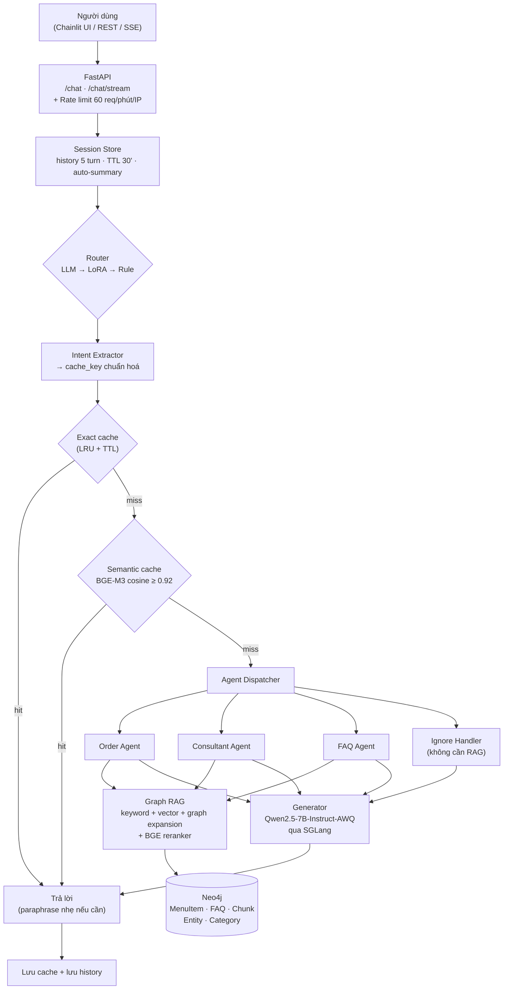
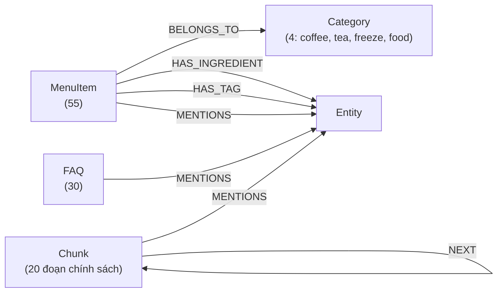
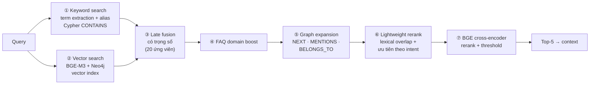

# MultiAgents RAG FnB — Chatbot tư vấn F&B bằng Multi-Agent + Graph RAG

Chatbot bán hàng cho một chuỗi cà phê (dữ liệu mô phỏng Highlands Coffee), xử lý 4 loại yêu cầu: **đặt món**, **tư vấn menu**, **hỏi thông tin quán (FAQ)** và **tin nhắn nhiễu**. Toàn bộ chạy **local**: LLM tự host bằng SGLang, dữ liệu nằm trong Neo4j, embedding/reranker là model mã nguồn mở, không gọi API cloud nào.

> Hướng dẫn cài đặt & chạy từng bước: xem [Instructions.md](Instructions.md).
> Tài liệu này tập trung vào **kiến trúc, cách từng luồng hoạt động, và lý do đằng sau từng lựa chọn kỹ thuật**.

---

## Mục lục

1. [Bài toán & mục tiêu thiết kế](#1-bài-toán--mục-tiêu-thiết-kế)
2. [Kiến trúc tổng thể](#2-kiến-trúc-tổng-thể)
3. [Tech stack và lý do chọn](#3-tech-stack-và-lý-do-chọn)
4. [Luồng xử lý một request (end-to-end)](#4-luồng-xử-lý-một-request-end-to-end)
5. [Router — phân loại ý định](#5-router--phân-loại-ý-định)
6. [Intent Extractor — chuẩn hoá câu hỏi thành cache key](#6-intent-extractor--chuẩn-hoá-câu-hỏi-thành-cache-key)
7. [Cache nhiều tầng](#7-cache-nhiều-tầng)
8. [Các Agent](#8-các-agent)
9. [Graph RAG — trái tim của hệ thống](#9-graph-rag--trái-tim-của-hệ-thống)
10. [LLM serving với SGLang](#10-llm-serving-với-sglang)
11. [Session & bộ nhớ hội thoại](#11-session--bộ-nhớ-hội-thoại)
12. [Concurrency, độ bền và fallback](#12-concurrency-độ-bền-và-fallback)
13. [Streaming (SSE) và chuẩn bị cho TTS](#13-streaming-sse-và-chuẩn-bị-cho-tts)
14. [Fine-tuning Router & Intent Extractor (QLoRA)](#14-fine-tuning-router--intent-extractor-qlora)
15. [Đánh giá & số liệu đo được](#15-đánh-giá--số-liệu-đo-được)
16. [Các bug đã tìm và sửa](#16-các-bug-đã-tìm-và-sửa)
17. [Hạn chế hiện tại & hướng phát triển](#17-hạn-chế-hiện-tại--hướng-phát-triển)
18. [Câu hỏi phỏng vấn thường gặp](#18-câu-hỏi-phỏng-vấn-thường-gặp)
19. [Cấu trúc thư mục](#19-cấu-trúc-thư-mục)

---

## 1. Bài toán & mục tiêu thiết kế

Một chatbot bán hàng F&B phải làm được nhiều việc **rất khác nhau** trong cùng một khung chat:

| Loại tin nhắn | Ví dụ | Điều quan trọng nhất |
|---|---|---|
| Đặt món (`order`) | "Cho anh 1 bạc xỉu đá size L" | **Chính xác tuyệt đối** về tên món, size, giá. Không được bịa. |
| Tư vấn (`consultant`) | "Trời nóng uống gì?", "Có gì ngon rẻ?" | Hiểu **khẩu vị/nhu cầu**, gợi ý món có thật trong menu |
| Thông tin quán (`faq`) | "Wifi quán là gì?", "Mấy giờ đóng cửa?" | Trả lời **đúng nguyên văn chính sách**, không suy diễn |
| Nhiễu (`ignore`) | "Hello", "haha", "thời tiết thế nào?" | Phản hồi nhanh, lịch sự, kéo khách về đúng việc |

Từ đó rút ra các mục tiêu thiết kế:

- **Không hallucinate**: mọi thông tin về món/giá/chính sách phải lấy từ dữ liệu → dùng **RAG**, và LLM bị ràng buộc bằng prompt + context có cấu trúc.
- **Mỗi loại việc một chuyên gia**: prompt, cách truy xuất, cách cache của từng loại khác nhau → **Multi-Agent** với một **Router** ở đầu.
- **Chạy local, phần cứng phổ thông** (mục tiêu RTX 3060 12GB): LLM 7B lượng tử hoá AWQ, giới hạn concurrency để không OOM.
- **Độ trễ thấp**: câu hỏi lặp lại (wifi, giờ mở cửa…) chiếm tỉ lệ lớn → **cache nhiều tầng** (exact + semantic), streaming token để giảm thời gian chờ cảm nhận.
- **Không bao giờ "chết"**: mỗi tầng đều có fallback (LLM sập → trả lời từ dữ liệu RAG; Router LLM lỗi → rule-based…).

---

## 2. Kiến trúc tổng thể



Hai ý tưởng kiến trúc cốt lõi:

1. **Tách "chuẩn bị" và "sinh câu trả lời"** (`prepare()` / `run()` trong [app/agents/base.py](app/agents/base.py)): bước `prepare()` làm RAG + dựng context + soạn sẵn *fallback answer*; bước sinh text chỉ là gọi LLM. Nhờ vậy cùng một agent phục vụ được cả API thường (`generate`) và API streaming (`stream_generate`), và khi LLM lỗi luôn có câu trả lời dự phòng dựa trên dữ liệu thật.
2. **Rẻ trước, đắt sau**: request đi qua các tầng theo thứ tự chi phí tăng dần — rule/regex (µs) → exact cache (µs) → semantic cache (1 lần embed, ~ms) → RAG + LLM (hàng trăm ms – giây). Tầng nào trả lời được thì dừng.

---

## 3. Tech stack và lý do chọn

| Thành phần | Công nghệ | Vai trò | Tại sao chọn |
|---|---|---|---|
| API | **FastAPI** + Uvicorn | REST + SSE streaming | Async native (phù hợp I/O tới LLM/Neo4j), Pydantic validate schema, tự sinh OpenAPI docs |
| Schema/Config | **Pydantic v2**, pydantic-settings, YAML | Toàn bộ input/output nội bộ + cấu hình tập trung trong [configs/](configs/) | Mọi thông số (model, threshold, trọng số, concurrency…) đổi trong YAML hoặc override qua biến môi trường, không sửa code — xem [3.1](#31-quản-lý-cấu-hình) |
| LLM | **Qwen2.5-7B-Instruct-AWQ** | Sinh câu trả lời, router LLM | Tiếng Việt tốt trong nhóm model 7B mở; AWQ 4-bit chỉ ~5GB VRAM, vừa GPU 12GB cùng embedding/reranker |
| LLM serving | **SGLang** | Server OpenAI-compatible | RadixAttention tái sử dụng KV-cache cho **prefix chung** (system prompt của mỗi agent lặp lại ở mọi request) → prefill nhanh hơn; chunked prefill; API chuẩn OpenAI nên đổi sang vLLM dễ |
| Graph DB | **Neo4j 5** | Lưu menu, FAQ, chính sách + quan hệ | Có sẵn **vector index** (HNSW) *và* truy vấn quan hệ (Cypher) trong cùng một DB → làm được hybrid + graph expansion mà không cần thêm vector DB riêng |
| Embedding | **BAAI/bge-m3** (1024 chiều) | Vector search + semantic cache | Đa ngôn ngữ, tiếng Việt tốt, 1 model dùng chung cho cả retrieval và cache |
| Reranker | **BAAI/bge-reranker-v2-m3** | Cross-encoder chấm lại (query, passage) | Chính xác hơn bi-encoder vì đọc query và passage cùng lúc; đa ngôn ngữ; dùng làm **guardrail** loại context không liên quan |
| Router nhỏ | **Qwen2.5-0.5B-Instruct + QLoRA** | Phân loại intent chạy local | Model 0.5B đủ cho bài toán 4 nhãn, latency thấp, không chiếm GPU của generator |
| Fine-tune | **PEFT (LoRA)**, **bitsandbytes** (4-bit NF4), Transformers | Huấn luyện router & intent extractor | QLoRA cho phép train trên GPU phổ thông |
| UI | **Chainlit** | Giao diện chat demo | Dựng UI chat trong vài chục dòng Python, hiển thị badge intent + latency |
| Hạ tầng | Docker (Neo4j), Conda (Python 3.11) | Môi trường | Tái lập môi trường nhanh |

**Vì sao Graph RAG thay vì RAG thuần vector?** Dữ liệu F&B có cấu trúc quan hệ tự nhiên: món ↔ danh mục ↔ nguyên liệu ↔ tag khẩu vị; FAQ ↔ chủ đề; đoạn chính sách ↔ đoạn kế tiếp. Vector search tìm được "đoạn giống câu hỏi", nhưng graph cho phép **mở rộng có kiểm soát**: tìm thấy "Bạc xỉu" thì kéo thêm các món cùng danh mục để gợi ý thay thế; tìm thấy 1 đoạn chính sách thì kéo thêm đoạn trước/sau để đủ ngữ cảnh.

**Vì sao hybrid (keyword + vector)?** Tên món là **từ khoá chính xác** ("bạc xỉu", "cappuccino") — keyword match chắc chắn hơn embedding. Nhưng câu hỏi tự nhiên ("internet ở đây dùng sao?" → FAQ wifi) cần hiểu ngữ nghĩa — vector làm tốt hơn. Kết hợp hai nguồn bằng late fusion có trọng số theo intent.

### 3.1 Quản lý cấu hình

Không có tham số nghiệp vụ nào hard-code trong code: tất cả nằm trong [configs/](configs/) và được nạp **một lần** qua [app/core/config.py](app/core/config.py).

| File | Nạp bằng | Nội dung |
|---|---|---|
| [configs/app.yaml](configs/app.yaml) | `get_settings()` | Tham số runtime: model, backend, Neo4j, ngưỡng, trọng số RAG, cache, timeout, concurrency, tham số SGLang server |
| [configs/lexicon.yaml](configs/lexicon.yaml) | `get_lexicon()` | Từ vựng miền: từ khoá router, stopword, alias, regex của intent extractor và semantic cache |
| [configs/training.yaml](configs/training.yaml) | `get_training_config()` | Siêu tham số QLoRA + `TrainingArguments` (truyền nguyên dict) |
| `.env` | (tự động) | Chỉ secret + override theo máy |

```python
from app.core.config import get_settings, get_lexicon

settings = get_settings()
settings.rag.fusion.faq.vector_weight          # 0.55
settings.reranker.threshold                    # 0.01
get_lexicon().router_rules.keywords["order"]   # ["cho anh", "gọi", ...]
```

Nguyên tắc thiết kế:
- **Một nguồn sự thật**: field trong schema Pydantic **không có giá trị mặc định** → mọi giá trị nằm trong YAML; thiếu key thì app báo lỗi ngay khi khởi động. Đường dẫn model chỉ khai báo ở `app.yaml`, script train/merge/evaluate và serving đều đọc từ đó (trước đây lặp ở 7 nơi).
- **Bắt lỗi gõ sai**: section dùng `extra="forbid"` — viết nhầm `treshold` sẽ báo `Extra inputs are not permitted` thay vì âm thầm dùng giá trị khác.
- **Override theo môi trường** (12-factor): biến môi trường > `.env` > `app.yaml`, key lồng nhau bằng `__`, được deep-merge: `LLM__BACKEND=sglang`, `RAG__TOP_K=8`, `NEO4J__PASSWORD=...`. Đổi cả bộ cấu hình bằng `APP_CONFIG_DIR`.
- **Tách tham số kỹ thuật và từ vựng**: người vận hành bổ sung từ khoá cho món/chính sách mới trong `lexicon.yaml` mà không đụng trọng số hay ngưỡng.
- **Cố ý giữ trong code**: câu chữ trả lời khách (prompt, fallback, paraphrase trong [app/prompts/](app/prompts/) và agent), câu Cypher, và system prompt của model LoRA (phải khớp nguyên văn dữ liệu train).

---

## 4. Luồng xử lý một request (end-to-end)

Điều phối nằm trong [app/services/chat_service.py](app/services/chat_service.py). Ví dụ `POST /chat {"text": "Cho mình 1 bạc xỉu size M", "session_id": "s1"}`:

| Bước | Việc làm | File |
|---|---|---|
| 1 | Validate request (text không rỗng, trim) | [app/core/schemas.py](app/core/schemas.py) |
| 2 | Rate limit theo IP (60 req/60s, bỏ qua `/health`) | [app/middleware/rate_limit.py](app/middleware/rate_limit.py) |
| 3 | Lấy/tạo session, **chụp history 5 turn gần nhất trước khi thêm câu hiện tại**, rồi lưu câu hỏi | [app/session/session_store.py](app/session/session_store.py) |
| 3b | **Order dialogue state**: nếu bot đang chờ khách trả lời ("xác nhận giúp em nhé?", "cần thêm gì không?") hoặc là lệnh giỏ hàng ("ok", "không", "xem đơn", "bỏ trà vải", "chốt đơn") → trả lời ngay, **bỏ qua router/RAG/LLM** (mục 8.2) | [app/services/order_state.py](app/services/order_state.py) |
| 4 | Router phân loại → `{"action": "order"}` (chạy trong queue `router`) | [app/agents/router_agent.py](app/agents/router_agent.py) |
| 4b | **Follow-up resolver**: nếu là câu nối tiếp ("lạnh", "size L", "còn trà thì sao?") → kế thừa intent lượt trước + dựng **standalone query** dùng cho RAG và cache | [app/services/conversation.py](app/services/conversation.py) |
| 5 | Intent Extractor sinh `cache_key` (vd. `"1 bạc xỉu size m"`) | [app/cache/intent_extractor.py](app/cache/intent_extractor.py) |
| 6 | Tra exact cache → semantic cache (order **không bao giờ cache**) | [app/cache/cache_service.py](app/cache/cache_service.py) |
| 7 | Dispatcher chọn `OrderAgent` | [app/agents/dispatcher.py](app/agents/dispatcher.py) |
| 8 | `prepare()`: Graph RAG → context có cấu trúc (`BEST_MATCH`, `ALTERNATIVES`, `ORDER_RULES`) + fallback answer | [app/agents/order_agent.py](app/agents/order_agent.py), [app/agents/context_builders.py](app/agents/context_builders.py) |
| 9 | Gọi LLM (trong queue `generator`, concurrency = 1) | [app/llm/sglang.py](app/llm/sglang.py) |
| 10 | Lưu cache (nếu intent cacheable) + lưu câu trả lời vào history | `chat_service.py` |
| 11 | Trả `ChatResponse`: `intent`, `agent`, `answer`, `sources`, `latency_ms`, `metadata` (router, cache, queue stats, extraction) | `schemas.py` |

`metadata` trả về rất chi tiết (router nào quyết định, vì sao, cache hit loại gì, similarity bao nhiêu…) — cố ý thiết kế để **debug và quan sát (observability)** được từng quyết định của hệ thống.

---

## 5. Router — phân loại ý định

Router quyết định request đi vào agent nào; sai ở đây thì mọi bước sau đều sai. Thiết kế **3 tầng với fallback**, chọn theo cấu hình ([app/agents/router_agent.py](app/agents/router_agent.py)):

```
router.backend = hf_lora | hf_merged  →  Qwen2.5-0.5B fine-tuned (local, transformers)
                                          └─ lỗi → rule-based
llm.backend    = sglang | vllm        →  LLM Router (Qwen 7B qua SGLang)
                                          └─ lỗi/timeout 8s/không parse được → rule-based
còn lại                               →  rule-based
```

### 5.1 LLM Router ([app/agents/llm_router.py](app/agents/llm_router.py))
- System prompt ngắn mô tả 4 nhãn, yêu cầu "chỉ trả về đúng 1 từ".
- `temperature=0`, `max_tokens=10` → output gần như tất định và rất ngắn (latency chủ yếu là prefill).
- Parse bằng cách tìm nhãn hợp lệ trong output; không parse được → fallback rule-based.
- Ưu điểm: hiểu ngôn ngữ tự nhiên, không phải duy trì từ khoá. Nhược điểm: tốn 1 lượt gọi LLM và **dùng chung GPU với generator** (SGLang đang cấu hình `max-running-requests 1`).

### 5.2 Router fine-tuned ([app/agents/router_hf_lora.py](app/agents/router_hf_lora.py))
- Qwen2.5-0.5B-Instruct + LoRA adapter (hoặc bản đã merge), decode greedy, `max_new_tokens=8`, fp16 trên GPU / fp32 trên CPU.
- Load lazy một lần (`lru_cache`). Chi tiết huấn luyện ở [mục 14](#14-fine-tuning-router--intent-extractor-qlora).

### 5.3 Rule-based router ([app/agents/intent_rules.py](app/agents/intent_rules.py))
Luôn có mặt làm lưới an toàn. Từ khoá nằm ở `router_rules` trong [lexicon.yaml](configs/lexicon.yaml), điểm số ở `router.rules` trong [app.yaml](configs/app.yaml). Cách chấm điểm:

| Nhóm | Điểm gốc | Ví dụ từ khoá |
|---|---|---|
| `order` | 0.70 | "cho anh", "gọi", "đặt", "order", "1 ly", "size m", "i want", "can i get" |
| `consultant` | 0.65 | "gợi ý", "tư vấn", "có gì ngon", "ít ngọt", "trời nóng", "recommend", "cheap" |
| `faq` | 0.75 | "wifi", "mật khẩu", "mấy giờ", "đóng cửa", "momo", "giao hàng", "hóa đơn" |
| `ignore` | 0.45 | "alo", "hello", "haha", "test" |

- Mỗi từ khoá khớp thêm +0.05 (tối đa +0.25).
- **Số lượng + tên món** ("1 bạc xỉu", "hai trà đào") → order +0.20.
- **Chỉ nói tên món** (không có tín hiệu FAQ/tư vấn) → order ≥ 0.55 (khách hay nhắn cộc lốc "bạc xỉu đá").
- **Câu hỏi + tên món + từ sở thích** ("trà đào có ngon không?") → consultant +0.15.
- **Ưu tiên order**: order ≥ 0.70 thì chốt order ngay — *trừ khi* đó là câu hỏi thông tin quán (có từ khoá FAQ + dấu hiệu câu hỏi + không có số lượng món). Ngoại lệ này sửa lỗi "Có thanh toán momo không?" bị đẩy sang order.
- Không khớp gì → `ignore` (an toàn: hỏi lại khách thay vì đoán bừa).

> **Vì sao giữ rule-based dù đã có LLM?** Nó chạy µs, không phụ thuộc GPU, và **luôn trả lời được** — hệ thống không bao giờ đứng vì router. Đổi lại độ chính xác thấp (67.5% trên test set, xem [mục 15](#15-đánh-giá--số-liệu-đo-được)), chủ yếu do câu không chứa từ khoá nào bị rơi vào `ignore`.

---

## 6. Intent Extractor — chuẩn hoá câu hỏi thành cache key

Vấn đề: "Wifi quán là gì?", "pass wifi bên mình?", "cho em xin mật khẩu mạng" là **cùng một câu hỏi** nhưng khác chữ → exact cache không bắt được. Intent Extractor ([app/cache/intent_extractor.py](app/cache/intent_extractor.py)) tách câu thành:

| Trường | Ý nghĩa | Ví dụ ("Cho em xin pass wifi với ạ") |
|---|---|---|
| `subject` | Ai hỏi | `em` |
| `action` | Hành động chuẩn hoá | `hỏi mật khẩu wifi` |
| `context` | Điều kiện kèm theo (thời gian, số người, ít ngọt, mang đi…) | `` |
| `cache_key` | Khoá dùng cho cache | `mật khẩu wifi` |

- **FAQ**: gom về khoá chủ đề (`mật khẩu wifi`, `giờ mở cửa đóng cửa`, `phương thức thanh toán`, `giao hàng mang đi`).
- **Consultant**: khoá = `gợi ý` + **các tiêu chí khẩu vị** trích được theo thứ tự cố định: loại đồ uống (cà phê/trà/freeze/bánh/không cà phê), độ ngọt (ít ngọt/ngọt), đậm vị, giải nhiệt, nóng, béo, dễ uống, giá rẻ. Ví dụ: "Trời nóng uống gì cho mát?" → `gợi ý giải nhiệt`; "Gợi ý món cà phê đậm vị" → `gợi ý cà phê đậm vị`.
- **Order**: giữ khoá đặc thù theo món (nhưng order không được cache).
- Có backend thay thế là model fine-tuned (Qwen2.5-0.5B + LoRA, output JSON) — [app/cache/intent_extractor_hf.py](app/cache/intent_extractor_hf.py).

> Thiết kế này **tách "hiểu câu hỏi" khỏi "tra cache"**: cache chỉ cần so khoá chuẩn hoá, còn việc hiểu biến thể ngôn ngữ dồn vào extractor (có thể nâng cấp từ rule → model mà không đụng cache).

---

## 7. Cache nhiều tầng

Mã nguồn: [app/cache/](app/cache/). Mọi entry đều gắn **intent** — cùng câu chữ nhưng khác intent không bao giờ dùng chung cache.

### 7.1 Chính sách: cái gì được cache?

| Intent | Cache? | Lý do |
|---|---|---|
| `faq` | ✅ | Thông tin ổn định (wifi, giờ, thanh toán), hỏi lặp lại rất nhiều |
| `consultant` | ✅ | Câu hỏi gợi ý lặp lại theo mẫu ("có gì ngon rẻ") |
| `ignore` | ✅ | Chào hỏi lặp lại |
| `order` | ❌ | **Phụ thuộc trạng thái** (món, size, số lượng, lịch sử giỏ hàng) — trả nhầm đơn của người khác là lỗi nghiêm trọng |

### 7.2 Tầng 1 — Exact cache ([exact_cache.py](app/cache/exact_cache.py))
- Key = `"{intent}:{cache_key đã chuẩn hoá}"` (lowercase, gộp khoảng trắng, bỏ `?!` cuối câu).
- `OrderedDict` làm **LRU**, TTL 30 phút, tối đa 1000 entry. Tra cứu O(1).

### 7.3 Tầng 2 — Semantic cache ([semantic_cache.py](app/cache/semantic_cache.py))
- Embed `cache_key` bằng BGE-M3 (vector đã chuẩn hoá L2 → cosine = dot product).
- Ngưỡng **theo intent** (`cache.semantic.thresholds`): FAQ 0.92, consultant 0.92, ignore 0.95. Ngưỡng cao vì trả nhầm cache tệ hơn cache miss.
- Chỉ so với entry **cùng intent**.
- **Domain alias** (chỉ cho FAQ): nếu bộ tag chủ đề của câu hỏi và của entry **trùng khớp hoàn toàn** (vd. cùng `{wifi}`) thì cho hit dù similarity dưới ngưỡng. Consultant không dùng alias vì tag thô (coffee/tea) không đủ phân biệt khẩu vị.
- **Backfill**: khi exact hit, đồng thời ghi sang semantic cache để các biến thể sau cũng hit.

### 7.4 Khi cache hit
- Trả lời ngay, không gọi RAG/LLM. Với consultant có **paraphrase nhẹ bằng template** ([paraphrase.py](app/cache/paraphrase.py)), ví dụ thêm "Dạ, với tiêu chí giá mềm, …" — để câu trả lời khớp ngữ cảnh mà **không tốn một lượt LLM**. FAQ giữ nguyên văn (thông tin chính sách không nên bị diễn đạt lại).
- Vô hiệu hoá khi dữ liệu đổi: `POST /cache/invalidate?intent=faq` hoặc xoá toàn bộ.

---

## 8. Các Agent

Tất cả kế thừa `BaseAgent` ([app/agents/base.py](app/agents/base.py)) với 2 bước:

```python
prepared = await agent.prepare(agent_input)   # RAG + context + fallback, KHÔNG gọi LLM
answer   = await llm.generate(prepared.llm_request)          # /chat
# hoặc:  async for tok in llm.stream_generate(prepared.llm_request)  # /chat/stream
```

| Agent | Truy xuất | Context gửi LLM | Luật trong prompt | Fallback khi không có LLM |
|---|---|---|---|---|
| **Order** | Tra đúng tên món trong menu → fallback RAG; lấy **mọi size** của món từ graph | `ORDER_STATE` (món, size có sẵn + giá, size khách chọn, số lượng) + `NEXT_ACTION` + `ORDER_RULES` (xem 8.1) | Làm đúng `NEXT_ACTION`, mỗi lượt 1 câu hỏi; **không tự chọn size**; không tự chốt đơn, không tự tính tổng | Câu trả lời tất định theo `NEXT_ACTION` (hỏi món / hỏi size / báo hết size / xin xác nhận) |
| **Consultant** | Menu + chính sách | `RECOMMENDABLE_MENU_ITEMS` (tối đa 5 món, **gộp các size của cùng món** thành 1 dòng) + `SUPPORTING_CONTEXT` + luật | Tối đa 3 gợi ý, chỉ gợi ý món có trong danh sách; thiếu thông tin thì hỏi lại 1 câu | Liệt kê 3 món đầu từ RAG + hỏi khẩu vị |
| **FAQ** | FAQ + chính sách (vector trọng số cao hơn) | `FAQ_CONTEXT` (tối đa 5) + `FAQ_RULES` | Chỉ trả lời từ context, tối đa 2 câu, không có dữ liệu thì nói không có | Trích nguyên văn FAQ khớp nhất |
| **Ignore** | Không RAG | — | Thừa nhận nhẹ nhàng + gợi ý 3 việc bot làm được | Câu chào mặc định |

### 8.1 Order như một nhân viên thật — slot filling

Mỗi size là một node `MenuItem` riêng, nên top-k của RAG chỉ là *một vài dòng menu*. Bản cũ lấy nguồn đứng đầu và xác nhận luôn ("Trà bưởi mật ong size S") dù khách **chưa chọn size**. [order_resolution.py](app/agents/order_resolution.py) giải quyết đơn một cách tất định:

1. **Guardrail món ngoài menu** (chạy đầu tiên): khách nhắc từ không có trong từ vựng menu ("phở", "pizza", "sinh tố") → "bên em chưa có món **phở bò**…", không đoán sang món gần giống. Guardrail ở tầng món thay vì dựa vào ngưỡng reranker (với truy vấn đã làm sạch, "phở bò" ↔ "Sừng Bò" vẫn đạt 0.026 > 0.01).
2. **Xác định món, tất cả trên toàn menu trong graph (không phụ thuộc top-k RAG):**
   - tên món nằm trọn trong câu → chọn luôn ("latte nóng" không bị reranker đẩy sang "Cà phê sữa nóng");
   - **từ đặc trưng** duy nhất → "trà bưởi" ⇒ Trà bưởi mật ong;
   - mơ hồ → **liệt kê mọi món có tên chứa đủ các từ khách nói**, kèm khoảng giá: "cho 2 trà" ⇒ cả 5 loại trà (45.000–65.000đ…), "cà phê sữa không đường" ⇒ Cà phê sữa đá / nóng ("không", "đường" là tuỳ chỉnh, bỏ qua khi lọc). Chỉ khi không lọc được mới dùng ứng viên RAG.
3. **Lấy mọi size + giá** của món từ graph ([app/rag/menu.py](app/rag/menu.py)), trích **size** ("size M", "ly vừa", "lớn ạ", "M"; lần nhắc sau cùng thắng) và **số lượng** ("2 ly", "hai cốc").
4. **Quyết định `NEXT_ACTION`:**

| NEXT_ACTION | Khi nào | Bot trả lời |
|---|---|---|
| `ASK_ITEM` | Nhiều món khớp mơ hồ ("cho 2 trà", "cà phê sữa") | Liệt kê món, hỏi chọn món nào |
| `ASK_SIZE` | Món nhiều size, khách chưa chọn | Liệt kê size + giá, hỏi size nào |
| `SIZE_UNAVAILABLE` | "size XL" | Báo không có, mời chọn size khác |
| `CONFIRM` | Đủ món + size (món một size như bánh thì không hỏi size) | "Em ghi nhận **2 Trà vải size L** — 65.000đ/ly, anh/chị xác nhận nhé?" |
| `NO_MATCH` | Không có món / món ngoài menu | Báo chưa có, mời xem menu |

**Câu hỏi còn món** ("có bán phở bò không", "có trà đào không", "còn bạc xỉu size L không ạ") trước đây bị router xếp `ignore`. Giờ router nhận diện bằng mẫu có chữ "bán"/"món", hoặc mẫu "có/còn … không" **kèm tên/loại món** (để "có wifi không", "có chỗ ngồi không" không bị bắt nhầm) → route order; câu trả lời mở đầu "**Dạ có ạ!**" (chỉ ở đúng lượt hỏi, không lặp ở lượt trả lời size) hoặc guardrail "chưa có món…".

Cùng một kết quả dùng cho context LLM (`ORDER_STATE` + `NEXT_ACTION`) **và** câu trả lời dự phòng → hai đường luôn nhất quán; LLM chỉ lo diễn đạt, không tự quyết logic đơn. Khi bot đang chờ trả lời (`ASK_ITEM`/`ASK_SIZE`), câu kế tiếp được ghép vào đơn dở (`order_pending`): "cho 2 trà" → "trà vải" → "L" ⇒ **2 Trà vải size L**. Với order, reranker chấm trên truy vấn đã làm sạch ("cho 2 trà" → "trà": 0.005 → 0.41).

### 8.2 Giỏ hàng & dialogue state tracking

Router phân loại từng câu độc lập, nên "ok" sau câu "Anh/chị xác nhận giúp em nhé?" từng bị xếp `ignore` → "Dạ em nghe ạ…". Nguyên nhân gốc: hệ thống **không nhớ bot đang chờ khách trả lời điều gì**. [OrderDialogueManager](app/services/order_state.py) chạy **trước router**, giữ trạng thái trong session:

- `cart`: các dòng đã chốt (món, size, số lượng, đơn giá) — cùng món cùng size thì cộng dồn;
- `pending`: điều bot đang chờ:

| pending | Khách nói | Bot làm |
|---|---|---|
| `confirm_line` (bot vừa hỏi xác nhận món) | "ok", "đúng rồi", "vâng" | Thêm vào giỏ, đọc đơn + **tạm tính**, hỏi "cần thêm gì không ạ?" |
| | "không", "sai rồi" | Chưa thêm, hỏi đổi size/số lượng/món — **giữ ngữ cảnh món** để "size L" sau đó sửa đúng món |
| `anything_else` | "không", "hết rồi", "vậy thôi" | Đọc lại đơn + **tổng cộng**, xin chốt |
| | "có" | "Anh/chị muốn gọi thêm món gì ạ?" |
| `confirm_checkout` | "ok" / "không" | Chốt đơn, mời thanh toán tại quầy / hỏi muốn chỉnh gì |
| `order_question` (đang hỏi món/size) | "thôi" | Bỏ câu hỏi đang dở |
| (mọi lúc) | "xem đơn", "bỏ trà bưởi", "chốt đơn", "huỷ đơn" | Lệnh giỏ hàng |
| (không chờ gì) | "ok", "không" | Đáp xã giao ("Dạ vâng ạ! Anh/chị cần em hỗ trợ gì thêm…") thay vì "Dạ em nghe ạ…" |

Các nguyên tắc:
- **Khớp trọn câu** (sau khi bỏ trợ từ "ạ", "nhé", "em"…): "ok em" là đồng ý, còn "Có thanh toán momo không?" vẫn đi pipeline FAQ. Câu dài/khác mẫu ("size M thôi", "3 ly") đi tiếp pipeline và được follow-up resolver ghép vào món đang chờ.
- **Tất định, không LLM/RAG** → trả lời trong vài ms; **tổng tiền do code tính**, LLM không bao giờ cộng tiền.
- **Hỏi FAQ chen giữa** khi còn món chờ xác nhận: trả lời FAQ rồi **nhắc lại món** ("À, món 1 Latte size L lúc nãy anh/chị xác nhận giúp em…") → "ok" sau đó vẫn thêm đúng món (`order_dialogue.pending_on_other_intents: remind`; đặt `clear` để bỏ món chờ). Câu nhắc không bị lưu vào cache.
- **Giữ 4 intent**: không thêm intent "cart" vào router (dataset/fine-tune dùng 4 nhãn); trạng thái hội thoại là một tầng riêng.
- "bỏ đá", "bớt đường" (tuỳ chỉnh món — chưa hỗ trợ) → nói thật và giữ nguyên trạng thái đơn, không đoán.

Đây chính là kiến trúc kinh điển của chatbot hướng tác vụ: **NLU** (router + intent extractor + trích size/số lượng) → **DST** (slot, giỏ hàng, `pending`) → **Policy** (`NEXT_ACTION`, bảng trên) → **NLG** (LLM theo context có cấu trúc, hoặc template).

```
👤 có bán trà không        🤖 Dạ có ạ! Bên em có các món: Trà sen vàng 45.000–65.000đ, Trà đào cam sả …
👤 trà bưởi                🤖 Trà bưởi mật ong có size S 49.000đ · M 59.000đ · L 69.000đ. Anh/chị dùng size nào ạ?
👤 vừa nhé                 🤖 Em ghi nhận 1 Trà bưởi mật ong size M — 59.000đ/ly. Anh/chị xác nhận giúp em nhé?
👤 ok                      🤖 Em đã thêm vào đơn. Tạm tính: 59.000đ. Anh/chị cần gọi thêm gì nữa không ạ?
👤 cho 2 bạc xỉu size L    🤖 Em ghi nhận 2 Bạc xỉu size L — 55.000đ/ly. Anh/chị xác nhận giúp em nhé?
👤 ok                      🤖 … Tạm tính: 169.000đ. Anh/chị cần gọi thêm gì nữa không ạ?
👤 bỏ trà bưởi             🤖 Em đã bỏ 1 Trà bưởi mật ong size M. Tạm tính: 110.000đ …
👤 không                   🤖 Em đọc lại đơn: 2 Bạc xỉu size L — 110.000đ. Tổng cộng: 110.000đ. Xác nhận chốt đơn nhé?
👤 ok                      🤖 Em đã chốt đơn ạ 🎉 … Anh/chị vui lòng thanh toán tại quầy.
```

**Guardrail chống hallucination theo nhiều lớp:**
1. **Context có cấu trúc** thay vì dán text thô: LLM thấy rõ đâu là món chính, giá, size, luật.
2. **Prompt ràng buộc** + few-shot "ví dụ tốt / ví dụ không tốt" ([app/prompts/](app/prompts/)).
3. **Empty-context guardrail** ([sglang.py](app/llm/sglang.py)): nếu RAG không tìm được gì, **không gọi LLM** mà trả thẳng fallback ("em chưa tìm thấy món này…") → LLM không có cơ hội bịa.
4. **Reranker threshold** loại context không liên quan trước khi tới LLM (vd. "Có bán phở bò không?" → không có context → trả lời không tìm thấy).

---

## 9. Graph RAG — trái tim của hệ thống

### 9.1 Mô hình đồ thị ([scripts/ingest_mock_to_neo4j.py](scripts/ingest_mock_to_neo4j.py))



- **MenuItem**: `name_vi`, `name_en`, `price`, `size` (S/M/L là 3 node riêng — vì mỗi size có giá riêng), `category`, `description`, `embedding`.
- **FAQ**: `topic`, `question`, `answer`, `embedding`.
- **Chunk**: đoạn chính sách (hoàn tiền, tuỳ chỉnh, combo…), nối nhau bằng `NEXT` theo thứ tự trong tài liệu.
- **Entity**: nguyên liệu, tag, và **11 domain entity** định nghĩa sẵn (chủ đề FAQ: wifi/giờ/giao hàng/size/thanh toán; sở thích: ít ngọt, giá rẻ; danh mục: coffee/tea/freeze/food) — liên kết bằng khớp từ khoá khi ingest.
- Tổng: 55 MenuItem, 30 FAQ, 20 Chunk, 157 Entity, 4 Category, **832 quan hệ**.
- Embedding BGE-M3 (1024 chiều) cho MenuItem/FAQ/Chunk ([app/rag/vector_index.py](app/rag/vector_index.py)) + 3 **Neo4j vector index** (cosine): `menu_embedding`, `faq_embedding`, `chunk_embedding`.

### 9.2 Pipeline truy xuất (`rag.retrieval_mode: hybrid_graph`)

Mã nguồn: [app/rag/retriever.py](app/rag/retriever.py); mọi trọng số/hệ số dưới đây nằm ở section `rag` của [app.yaml](configs/app.yaml), stopword/alias ở `retrieval` của [lexicon.yaml](configs/lexicon.yaml). Nguyên tắc: **"retrieve wide, rerank narrow"** — lấy rộng 20 ứng viên, chỉ cắt về top-5 sau cùng.



**① Keyword search**
- Chuẩn hoá query (lowercase, bỏ ký tự đặc biệt), map **alias** về dạng chuẩn (`cafe/coffee → cà phê`, `password/mật khẩu → wifi`, `bac xiu → bạc xỉu`), bỏ **stopword** tiếng Việt ("cho", "anh", "ly", "quán", "những"…), giữ tối đa 6 term dài nhất.
- Mỗi term chạy Cypher `CONTAINS` trên tên/mô tả/danh mục/tag/nguyên liệu (menu), câu hỏi/chủ đề/câu trả lời (FAQ), nội dung + entity (chunk). Truy vấn theo intent: order → menu; consultant → menu + chunk; FAQ → FAQ + chunk.
- Điểm gốc: menu 0.95 nếu term nằm trong **tên món**, 0.85 nếu chỉ trong mô tả; FAQ 0.95; chunk 0.70.
- **Thưởng theo độ phủ term**: `score × (0.6 + 0.4 × số_term_khớp / tổng_term)` — nguồn khớp nhiều term (vd. "freeze" khớp cả "đá" lẫn "xay") xếp trên nguồn chỉ khớp một từ chung.

**② Vector search** — embed query, gọi `db.index.vector.queryNodes` (top 20) cho từng loại node theo intent; nếu index chưa tạo thì fallback tính cosine bằng Python.

**③ Late fusion** — cộng điểm có trọng số theo `source_id`:

| Intent | Keyword | Vector | Lý do |
|---|---|---|---|
| order / consultant | 0.65 | 0.35 | Tên món là từ khoá chính xác → tin keyword hơn |
| faq | 0.45 | 0.55 | Câu hỏi FAQ diễn đạt rất đa dạng ("internet", "mạng", "pass") → tin ngữ nghĩa hơn |

**④ FAQ domain boost** — nếu query chứa từ khoá của chủ đề (wifi, giờ, giao hàng, size) thì FAQ cùng chủ đề +0.35.

**⑤ Graph expansion** (điểm = điểm gốc × 0.75 × hệ số quan hệ):
- Chunk → chunk **trước/sau** (`NEXT`) — chính sách thường bị cắt giữa chừng.
- Chunk/FAQ → **Entity** được nhắc tới (`MENTIONS`, ×0.85).
- MenuItem → **món cùng danh mục** (`BELONGS_TO`, ×0.65) — nguồn "gợi ý thay thế" cho order/consultant.

**⑥ Lightweight rerank** — +0.15 × tỉ lệ từ query xuất hiện trong nguồn; nguồn từ expansion ×0.85; ưu tiên loại nguồn khớp intent (order-menu ×1.10, faq-faq ×1.10, consultant-menu/doc ×1.05).

**⑦ BGE cross-encoder rerank** ([app/rag/reranker.py](app/rag/reranker.py)) — chấm lại từng cặp (query, passage), sắp xếp, lấy top-5 và **loại nguồn có điểm < `reranker.threshold` (0.01)**. Điểm của model là xác suất sigmoid: nguồn đúng thường 0.02–0.99, câu hỏi ngoài dữ liệu ≤ 0.003 → ngưỡng này đóng vai trò guardrail "không có dữ liệu thì không trả lời". Model load lazy, lỗi load thì tự tắt (trả nguyên thứ tự cũ).

> Mọi chế độ khác vẫn giữ để so sánh/ablation: `keyword`, `vector`, `hybrid`, `hybrid_graph`.

---

## 10. LLM serving với SGLang

- [scripts/SGLang_Server.sh](scripts/SGLang_Server.sh) → [scripts/launch_sglang.py](scripts/launch_sglang.py) dựng câu lệnh từ `llm.model` + `llm.server`: `Qwen/Qwen2.5-7B-Instruct-AWQ`, `--context-length 4096`, `--mem-fraction-static 0.65` (chừa ~35% VRAM cho BGE-M3 + reranker + router), `--max-running-requests 1`, `--chunked-prefill-size 1024`, `--schedule-policy lpm` (longest-prefix-match: ưu tiên request có prefix đã cache — hợp với việc mỗi agent dùng lại cùng system prompt).
- Client ([app/llm/sglang.py](app/llm/sglang.py)) gọi API `/v1/chat/completions` chuẩn OpenAI → đổi sang vLLM/OpenAI-compatible server bất kỳ chỉ cần đổi `llm.base_url`.
- Messages = `system` (prompt agent + tóm tắt hội thoại nếu có) + history + `user` (CONTEXT + câu hỏi). `temperature=0.2`, `max_tokens=512`.
- **Backend `mock`** ([app/llm/mock.py](app/llm/mock.py)): trả về fallback answer của agent → chạy/test toàn bộ pipeline RAG + cache trên máy không có GPU.
- Factory pattern ([app/llm/factory.py](app/llm/factory.py)) chọn backend theo `llm.backend`.

---

## 11. Session & bộ nhớ hội thoại

[app/session/session_store.py](app/session/session_store.py) — in-memory, bảo vệ bằng `asyncio.Lock`:

- **TTL 30 phút**, task nền dọn session hết hạn mỗi 60 giây.
- **Cửa sổ history 5 message** gần nhất được gửi kèm cho router và agent.
- **Auto-summarization**: khi tổng history vượt **70% của 4096 token** (ước lượng 4 ký tự/token), phần cũ được LLM tóm tắt (≤ 80 từ, giữ món đã đặt, yêu cầu đặc biệt, FAQ đã trả lời), chỉ giữ 5 message gần nhất + summary. Summary được **chèn vào system prompt** ở các lượt sau → nhớ được ngữ cảnh dài mà không tràn context 4096 của model.
- Nếu tóm tắt lỗi → cắt cứng history để bảo vệ context window.

### 11.1 Hội thoại nhiều lượt — câu hỏi nối tiếp (follow-up)

**Vấn đề:** router phân loại **từng câu độc lập**. Bot hỏi lại "Anh/chị muốn ít ngọt, nhiều cà phê hay mát lạnh hơn ạ?", khách trả lời "lạnh" → không có từ khoá nào → `ignore`; và kể cả route đúng thì RAG cũng chỉ tìm với "lạnh", **mất tiêu chí "ít ngọt"** của câu trước.

**Giải pháp:** [ConversationResolver](app/services/conversation.py) chạy ngay sau router, trạng thái lưu trong session (`last_intent`, các câu của chủ đề hiện tại, số lượt):

1. **Nhận diện follow-up** — chỉ khi: có lượt nghiệp vụ trong ≤ 3 lượt gần nhất, câu ≤ 8 từ, không phải lời chào/cảm ơn (so khớp nguyên từ), **và** một trong các lý do:

   | Lý do | Ví dụ | Ghi chú |
   |---|---|---|
   | `router_no_intent` | "lạnh", "tôi muốn lạnh" | Router ra `ignore` nhưng ngay sau một chủ đề |
   | `followup_marker` | "còn trà thì sao?", "cái nào rẻ hơn" | Có từ nối (`còn…`, `thì sao`, `…hơn`) và router không có tín hiệu mạnh cho intent khác |
   | `refine_same_intent` | "ít đá thôi" sau câu tư vấn | Chỉ cho `consultant` — với order, câu mới thường là **món mới** |
   | `order_modifier_without_item` | "size L" sau "Cho mình 1 bạc xỉu" | Câu order không nêu tên món → sửa món đang đặt |

2. **Kế thừa intent** của lượt trước.
3. **Dựng standalone query** (kỹ thuật *query condensation*): nếu có SGLang thì LLM viết lại câu cuối thành câu độc lập ([prompt](app/prompts/conversation.py)); không có LLM hoặc lỗi → ghép **câu mở đầu chủ đề + các câu gần nhất**. Query này dùng cho RAG **và** intent extractor → cache key giữ đủ tiêu chí:

```
"Gợi ý món ít ngọt"  → consultant            key: gợi ý ít ngọt
"lạnh"               → consultant (kế thừa)  key: gợi ý ít ngọt đồ lạnh
"cái nào rẻ hơn"     → consultant (kế thừa)  key: gợi ý ít ngọt đồ lạnh giá rẻ
"hello"              → ignore — không xoá ngữ cảnh
"Wifi quán là gì?"   → faq — chủ đề mới, không bị ghép
```

Lời chào xen giữa không xoá ngữ cảnh; câu dài hoặc có tín hiệu mạnh của intent khác được coi là chủ đề mới. Mọi ngưỡng nằm ở `conversation` trong [app.yaml](configs/app.yaml), từ nối/lời chào ở `conversation` trong [lexicon.yaml](configs/lexicon.yaml). Metadata `conversation` (lý do, standalone query) được trả về trong response và hiển thị ở footer Chainlit.

---

## 12. Concurrency, độ bền và fallback

**Hàng đợi theo loại tải** ([app/queueing/request_queue.py](app/queueing/request_queue.py)) — `asyncio.Semaphore` + timeout + retry:

| Queue | Concurrency | Lý do |
|---|---|---|
| `router` | 8 | Nhẹ (rule/0.5B) |
| `generator` | **1** | LLM 7B là tài nguyên đắt nhất; chạy song song trên GPU 12GB dễ OOM |
| `embedding` / `reranker` | 2 / 1 | Khai báo sẵn cho model GPU (hiện chưa được dùng — xem mục 17) |

- Timeout 60s/request, **retry 3 lần với exponential backoff** (0.3s → 0.6s → 1.2s).
- Lỗi được map thành HTTP rõ nghĩa: timeout hàng đợi → **503** `queue_timeout`, lỗi sau retry → **503** `service_unavailable`, còn lại → **500**.

**Bảng fallback — hệ thống xuống cấp dần chứ không sập:**

| Sự cố | Hệ thống làm gì |
|---|---|
| SGLang không phản hồi | Router → rule-based; Agent → trả fallback answer dựng từ dữ liệu RAG |
| LoRA router lỗi load/infer | Rule-based, ghi `fallback_from` vào metadata |
| RAG không tìm thấy gì | Không gọi LLM, trả câu "chưa tìm thấy" (chống bịa) |
| Neo4j vector index chưa tạo | Tính cosine bằng Python trên embedding lưu trong node |
| Reranker không load được | Tự tắt, giữ thứ tự từ bước trước |
| Intent extractor / semantic cache lỗi | Bỏ qua, tra cache bằng text gốc / coi như miss |
| Tóm tắt hội thoại lỗi | Cắt cứng history |

---

## 13. Streaming (SSE) và chuẩn bị cho TTS

`POST /chat/stream` ([app/api/routes.py](app/api/routes.py)) trả **Server-Sent Events**:

```
METADATA {ttft_ms, session_id, intent, cache_hit}   ← ngay khi có token đầu tiên
TOKEN    {token}                                     ← từng token từ SGLang
CLAUSE   {clause}                                    ← mỗi khi gom đủ một mệnh đề
[DONE]
```

- Token lấy thật từ SGLang (`stream: true`), đo **TTFT** (time-to-first-token) — chỉ số người dùng cảm nhận rõ nhất.
- **ClauseSplitter** ([app/streaming/clause_splitter.py](app/streaming/clause_splitter.py)) gom token thành mệnh đề theo dấu câu (≥ 12 ký tự) → sẵn sàng đẩy từng mệnh đề sang **Text-to-Speech** để bot "nói" gần như đồng thời khi đang sinh chữ. Đã có hàm tiền xử lý cho TTS (vd. `49.000đ → 49k`) ở [app/utils/tts_preprocess.py](app/utils/tts_preprocess.py), nhưng **chưa nối vào pipeline**.
- Cache hit cũng được stream theo cùng giao thức → client xử lý một kiểu duy nhất.
- Header `X-Accel-Buffering: no` để Nginx không gom buffer làm mất hiệu ứng stream.

---

## 14. Fine-tuning Router & Intent Extractor (QLoRA)

| | Router | Intent Extractor |
|---|---|---|
| Dataset | 800 mẫu (200/intent; 587 vi, 213 en; 120 "hard") — [data/router/](data/router/) | 1000 mẫu (250/intent; 696 vi, 304 en) — [data/intent_extraction/](data/intent_extraction/) |
| Output | 1 nhãn: `order`/`consultant`/`faq`/`ignore` | JSON: `subject, action, context, cache_key, intent, language` |
| Sinh dữ liệu | [generate_router_dataset.py](scripts/generate_router_dataset.py) — seed + biến thể (hậu tố "nhé/ạ/please", lỗi gõ/viết tắt "ko/k/dc/mik/wf", câu khó) | [generate_intent_extraction_dataset.py](scripts/generate_intent_extraction_dataset.py) |
| Train | [train_router_sft.py](scripts/train_router_sft.py) | [train_intent_extractor_sft.py](scripts/train_intent_extractor_sft.py) |

Cấu hình chung: **Qwen2.5-0.5B-Instruct**, **QLoRA** (load 4-bit NF4 + double quantization, compute fp16), LoRA `r=16`, `alpha=32`, `dropout=0.05` trên toàn bộ projection attention (`q/k/v/o_proj`) và MLP (`gate/up/down_proj`), 5 epoch, `lr=2e-4`, chọn checkpoint theo `eval_loss` từng epoch. Sau train có script **merge adapter** vào base model ([merge_router_lora.py](scripts/merge_router_lora.py)) để suy luận nhanh hơn (`router.backend: hf_merged`). Siêu tham số nằm trong [configs/training.yaml](configs/training.yaml), đường dẫn model lấy từ `router.hf` / `intent_extractor.hf` của `app.yaml`. Có script đánh giá ([evaluate_router_sft.py](scripts/evaluate_router_sft.py), [evaluate_intent_extractor_sft.py](scripts/evaluate_intent_extractor_sft.py)) và kiểm tra chất lượng dataset (đủ trường, nhãn hợp lệ, phân bố intent/ngôn ngữ/độ khó — [tests/](tests/)).

**Vì sao fine-tune model 0.5B thay vì prompt model 7B?** Phân loại 4 nhãn là bài toán hẹp: model nhỏ fine-tune thường đạt độ chính xác ngang/hơn model lớn prompt zero-shot, nhưng rẻ hơn nhiều lần, và **không tranh GPU với generator** (router 7B phải xếp hàng sau request sinh text vì `max-running-requests 1`).

> Lưu ý: repo không kèm trọng số đã train (`models/` nằm trong `.gitignore`).

---

## 15. Đánh giá & số liệu đo được

Môi trường đo: laptop **không dùng được GPU** (driver NVIDIA lỗi) → embedding + reranker chạy **CPU**, `llm.backend: mock`. Số liệu retrieval/router không phụ thuộc LLM; số liệu latency là cận trên (GPU sẽ nhanh hơn đáng kể).

### Retrieval — [tests/rag_retrieval_benchmark.py](tests/rag_retrieval_benchmark.py) (20 câu, intent cố định)

| Cấu hình | Top-1 | Top-5 |
|---|---|---|
| Ban đầu (threshold 0.7, cắt top-5 trước rerank) | 35% | 35% |
| Chỉ hạ threshold về 0 | 85% | 90% |
| Tắt hẳn reranker | 90% | 90% |
| Pool 20 ứng viên + điểm theo độ phủ + threshold 0.01 | 85% | 85% |
| **Hiện tại** (+ stopword động từ order, reranker chấm truy vấn đã làm sạch cho order) | **85%** | **90%** |

Đọc số liệu cho đúng: tắt reranker cho top-1 cao nhất trên bộ 20 câu này, nhưng khi đó **mất guardrail** — câu ngoài dữ liệu ("Có bán phở bò không?") vẫn nhận context "Sừng bò" và bot sẽ gợi ý sai món. Bản hiện tại đánh đổi 1 câu để có guardrail và kết quả **ổn định giữa các lần chạy** (bản cũ thay đổi theo hash seed do hoà điểm). Benchmark còn nhỏ và chấm bằng từ khoá (vd. câu "size" chấp nhận chữ "s") → cần bộ đánh giá lớn hơn, chấm theo `source_id`.

### Router rule-based — [scripts/evaluate_router_dataset.py](scripts/evaluate_router_dataset.py) (80 câu test)

| | Accuracy |
|---|---|
| | Ban đầu | Sau khi bổ sung từ khoá tư vấn |
|---|---|---|
| Tổng | 67.5% (54/80) | **76.25%** (61/80) |
| Tiếng Việt / Tiếng Anh | 71.2% / 60.7% | 84.6% / 60.7% |
| Easy / Hard | 66.7% / 70.0% | 75.0% / 80.0% |

Lưu ý trung thực: một phần từ khoá bổ sung ("dễ uống", "món nào") trùng với câu sai trong **chính tập test** → 76.25% là con số lạc quan, không phải đánh giá độc lập. Lỗi còn lại phần lớn là câu **không chứa từ khoá** nào ("Internet ở đây dùng sao?", "Any drink for hot weather?") → đây chính là lý do cần router LLM hoặc router fine-tuned.

### Latency (CPU, mock LLM)

| Trường hợp | Latency |
|---|---|
| Exact cache hit | ~57 ms |
| Ignore (không RAG) | ~140 ms |
| Order / FAQ / Consultant (RAG + reranker CPU trên ~20 ứng viên) | 3.7 – 5.5 s |
| Request đầu tiên (load BGE-M3 + reranker) | ~90 s (cold start) |

---

## 16. Các bug đã tìm và sửa

Phát hiện khi đo đạc lại hệ thống — mỗi bug đều được tái hiện bằng dữ liệu trước khi sửa:

| # | Bug | Triệu chứng | Nguyên nhân gốc | Cách sửa |
|---|---|---|---|---|
| 1 | Reranker xoá sạch context | Tư vấn luôn trả "chưa có đủ dữ liệu"; retrieval top-5 chỉ 35% | Ngưỡng 0.7 áp lên xác suất sigmoid (nguồn đúng chỉ 0.02–0.2) **và** fusion cắt về top-5 trước khi rerank, lại hoà điểm nên kết quả thay đổi theo hash seed | Ngưỡng 0.01 (hiệu chỉnh theo phân bố điểm thật); lấy pool 20 ứng viên rồi mới rerank; điểm keyword thưởng theo độ phủ term; thêm stopword "quán", "những" |
| 2 | Cache tư vấn trả nhầm | "Gợi ý cà phê đậm vị" rồi "Trời nóng uống gì?" → câu sau nhận đáp án câu trước | Mọi câu consultant bị gom về 1–2 cache key; semantic alias cho hit chỉ vì cùng tag "recommendation" | Cache key chứa tiêu chí khẩu vị; alias chỉ áp cho FAQ và yêu cầu trùng khớp hoàn toàn bộ tag; sửa nhận diện tiếng Việt (ký tự `ờ, ó, á` không khớp `ơ, o, a`) |
| 3 | Truy vấn chính sách trả toàn bộ tài liệu | Từ khoá vô nghĩa vẫn ra 20/20 chunk | `WHERE` gắn vào `OPTIONAL MATCH` chỉ lọc entity, không lọc chunk | Dùng `EXISTS { … }` subquery |
| 4 | Vector search FAQ sai index | FAQ không bao giờ lấy được qua vector index | Truy vấn `chunk_embedding` rồi lọc `:FAQ` → luôn rỗng | Dùng `faq_embedding` |
| 5 | Câu hỏi bị gửi 2 lần cho LLM; tóm tắt hội thoại không được dùng | Tốn token, lệch prompt; auto-summary vô tác dụng | History được lấy **sau** khi lưu câu hiện tại; `summary` không được truyền vào request | Chụp history trước khi lưu; thêm trường `summary` vào LLM request và chèn vào system prompt |
| 6 | "Có thanh toán momo không?" bị route sang order | Hỏi thông tin lại bị xử lý như đặt món | "thanh toán" là từ khoá order và order được ưu tiên tuyệt đối | Ngoại lệ cho câu hỏi thông tin quán không có số lượng món |
| 7 | Cấu hình không có tác dụng / mâu thuẫn | Đổi `history_window` không đổi gì; ngưỡng semantic cache có 2 bộ giá trị khác nhau | `recent_history()` hard-code `window=5`; `getattr(settings, ..., default)` mang default riêng (0.95/0.94/0.97) khác config (0.92); đường dẫn model lặp ở 7 file | Gom toàn bộ tham số vào `configs/*.yaml`, schema không default + `extra="forbid"`; kiểm chứng refactor bằng so sánh đầu ra trước/sau trên 805 câu router, 3220 lượt extractor, 10 truy vấn retrieval: 0 sai khác |
| 8 | Hội thoại "đứt" sau câu đầu | "Gợi ý món ít ngọt" trả lời tốt, nhưng "lạnh" / "tôi muốn lạnh" → "Dạ em nghe ạ…" (`ignore`) | Router phân loại từng câu độc lập; RAG chỉ dùng câu hiện tại; `SessionState.last_intent` khai báo nhưng không bao giờ được gán; "lạnh" không có trong từ vựng dù bot tự hỏi "mát lạnh hơn ạ?" | Follow-up resolver + standalone query (mục 11.1); thêm tiêu chí "đồ lạnh" và từ khoá tư vấn |
| 9 | Order không như nhân viên thật | Gợi ý thấy rõ 3 size nhưng "trà bưởi mật ong" → bot tự xác nhận size S, không hỏi size; "cho 2 trà" → *không tìm thấy món*; "latte nóng" → ra Cà phê sữa nóng | Order agent chỉ lấy nguồn RAG đứng đầu (một size); top-k chứa các size trùng nhau của ~2 món; cross-encoder chấm câu có từ đệm rất thấp | Slot filling tất định (mục 8.1): tra tên món trên toàn menu, lấy mọi size từ graph, `NEXT_ACTION`, guardrail từ vựng menu, reranker chấm truy vấn đã làm sạch |
| 10 | Không chốt được đơn | Bot hỏi "xác nhận giúp em nhé?", khách "ok" → "Dạ em nghe ạ…"; "có bán phở bò không" → `ignore`; "cho 2 trà" chỉ liệt kê 2/5 loại trà | Không có trạng thái "bot đang chờ gì"; router không có khái niệm câu hỏi còn món; ứng viên món lấy từ top-k RAG | Order dialogue state + giỏ hàng chạy trước router (mục 8.2); mẫu câu hỏi còn món; liệt kê ứng viên từ toàn menu trong graph |

---

## 17. Hạn chế hiện tại & hướng phát triển

**Hiệu năng**
- `SentenceTransformer.encode`, `CrossEncoder.predict` và driver Neo4j đồng bộ được gọi trực tiếp trong code async → **chặn event loop**, request này chờ request kia. Hướng sửa: `asyncio.to_thread` + dùng các queue `embedding`/`reranker` đã khai báo.
- Mỗi term keyword là 1 truy vấn `CONTAINS` (quét toàn bộ), graph expansion 1 truy vấn/nguồn (N+1). Hướng sửa: gộp bằng `UNWIND`, dùng **full-text index** của Neo4j.
- Tạo `httpx.AsyncClient` mới mỗi lần gọi LLM → mất connection pooling.
- Cold start ~90s: nên warm-up model trong `lifespan` khi khởi động ([scripts/warmup_system.py](scripts/warmup_system.py) đã có sẵn).
- Tóm tắt hội thoại chạy **trong lúc giữ lock** của session store.

**Chất lượng**
- Router rule-based 67.5% → cần router đã fine-tune, hoặc phương án rẻ: **classifier trên embedding BGE-M3** (Logistic Regression train trên 640 mẫu có sẵn, ~20ms trên CPU).
- Reranker chấm thấp một số cặp tiếng Việt đúng nghĩa ("internet" ↔ FAQ wifi ≈ 0.005) → fine-tune reranker trên dữ liệu miền, hoặc **kết hợp điểm** (score fusion/RRF) giữa retrieval và rerank thay vì ngưỡng tuyệt đối.
- Order: mỗi câu chỉ xử lý **một món** ("cho 1 bạc xỉu và 2 trà vải" mới lấy được một món); chưa hỗ trợ **tuỳ chỉnh** (ít đá, không đường — hiện trả lời trung thực là chưa ghi được); "đổi trà vải thành size L" với món đã nằm trong giỏ chưa được hỗ trợ (phải bỏ rồi gọi lại). Đơn đã chốt chỉ lưu trong session, chưa gửi sang hệ thống POS.
- Giỏ hàng và trạng thái hội thoại nằm trong RAM của session (TTL 30 phút) — cần Redis nếu scale nhiều instance.
- Từ vựng menu (`get_menu_names`, `get_menu_vocabulary`) được cache theo process → sau khi ingest lại menu cần restart backend.
- Tiêu chí so sánh ("rẻ hơn", "ít ngọt hơn") mới chỉ được hiểu như từ khoá — retrieval chưa lọc/sắp xếp theo **giá** hay thuộc tính số. Hướng: trích slot có cấu trúc (budget, sweetness) rồi lọc bằng Cypher `WHERE m.price < $max`.
- Khi không có LLM (`llm.backend: mock`), câu trả lời là fallback liệt kê thô nguồn RAG (lặp tên món theo từng size).

**Vận hành**
- Session và cache nằm trong RAM của 1 process → mất khi restart, không scale nhiều instance. Hướng: **Redis** (session, exact cache) + vector store cho semantic cache.
- Rate limit in-memory theo IP → cần Redis/gateway khi scale ngang.
- Chainlit gọi `/chat` rồi tự tạo hiệu ứng gõ chữ, chưa dùng `/chat/stream` thật.
- Chưa có CI, bộ test pytest tự động và bộ đánh giá end-to-end lớn (chấm theo `source_id`, LLM-as-judge cho câu trả lời).

---

## 18. Câu hỏi phỏng vấn thường gặp

**Vì sao multi-agent mà không một prompt lớn?**
Mỗi loại việc cần cách truy xuất, ràng buộc và chính sách cache khác nhau (order không cache, FAQ giữ nguyên văn, consultant tối đa 3 gợi ý). Tách agent giúp prompt ngắn và chuyên biệt (LLM 7B tuân thủ tốt hơn), dễ test/đo từng luồng, và thêm luồng mới (vd. khiếu nại) không ảnh hưởng luồng cũ.

**Làm sao chống hallucination?**
4 lớp: RAG bắt buộc → context có cấu trúc (BEST_MATCH/RULES) → prompt ràng buộc + few-shot → **không gọi LLM khi context rỗng** và reranker threshold loại context không liên quan.

**Graph mang lại gì so với vector DB?**
Mở rộng ngữ cảnh theo quan hệ có nghĩa: món cùng danh mục (gợi ý thay thế), đoạn chính sách liền kề (đủ ngữ cảnh), entity chủ đề. Và Neo4j có sẵn vector index nên hybrid + graph nằm trong 1 DB.

**Semantic cache có rủi ro gì?**
Trả nhầm đáp án cho câu "gần giống nhưng khác ý" (chính là bug #2). Giảm rủi ro bằng: cache theo intent, ngưỡng cao (0.92–0.95), không cache order, cache key chứa tiêu chí quan trọng, alias chỉ khi bộ tag trùng khớp hoàn toàn, và endpoint invalidate khi dữ liệu đổi.

**Vì sao `generator` concurrency = 1?**
Mục tiêu là GPU 12GB: model 7B AWQ + KV-cache + BGE-M3 + reranker. Chạy song song dễ OOM; semaphore + timeout + retry cho hệ thống xếp hàng có kiểm soát và trả 503 rõ ràng thay vì sập. Muốn thông lượng cao hơn: tăng `max-running-requests` của SGLang (continuous batching) trên GPU lớn hơn.

**Chọn ngưỡng reranker thế nào?**
Đo phân bố điểm thực tế: nguồn đúng 0.02–0.99, câu ngoài dữ liệu ≤ 0.003 → chọn 0.01. Bài học: điểm cross-encoder là xác suất chưa hiệu chỉnh cho miền dữ liệu, không thể chọn ngưỡng theo cảm tính (0.7 cũ loại gần hết context đúng).

**Làm sao bot biết "ok" nghĩa là gì?**
Router phân loại từng câu độc lập nên không thể biết. Cần *dialogue state tracking*: session lưu `pending` — điều bot vừa hỏi (xác nhận món, "cần thêm gì không", xác nhận chốt đơn). Một tầng tất định chạy **trước router** diễn giải "ok"/"không"/"hết rồi" theo `pending`, quản lý giỏ hàng và tự tính tổng tiền. Chỉ khớp trọn câu nên không nuốt nhầm câu hỏi thật; khách hỏi FAQ chen giữa thì bot trả lời rồi nhắc lại món đang chờ. Tổng thể là kiến trúc NLU → DST → Policy → NLG của chatbot hướng tác vụ, trong đó LLM chỉ đảm nhận NLG.

**Bot order xử lý thiếu thông tin thế nào?**
Slot filling tất định: xác định món (tra tên chính xác → khớp từ đặc trưng → hỏi lại nếu mơ hồ), lấy mọi size từ graph, trích size/số lượng, rồi quyết định `NEXT_ACTION` (hỏi món / hỏi size / báo hết size / xác nhận). Logic nằm trong code, LLM chỉ diễn đạt theo `NEXT_ACTION` → không bao giờ "tự chọn size giùm khách". Guardrail món ngoài menu dựa trên từ vựng menu, vì ngưỡng reranker không đủ tin cậy.

**Làm sao để hội thoại nhiều lượt liền mạch?**
Router và RAG vốn xử lý từng câu độc lập, nên câu trả lời ngắn cho câu hỏi làm rõ ("lạnh") bị mất ngữ cảnh. Thêm một tầng *follow-up resolution* sau router: nhận diện câu nối tiếp bằng luật có kiểm soát (câu ngắn, gần lượt trước, router không có tín hiệu mạnh, có từ nối), kế thừa intent, rồi *condense* thành câu hỏi độc lập (LLM viết lại, fallback ghép chuỗi) để RAG và cache dùng. Điểm quan trọng là **không ghép bừa**: câu có tín hiệu mạnh của intent khác (hỏi wifi) hay order món mới vẫn là chủ đề mới.

**Quản lý cấu hình thế nào?**
Tham số nằm trong YAML có schema Pydantic (không default, cấm key lạ) → sai cấu hình là lỗi lúc khởi động chứ không phải bug âm thầm lúc chạy. Secret và khác biệt giữa môi trường đi qua biến môi trường (`LLM__BACKEND`, `NEO4J__PASSWORD`). Từ vựng miền tách riêng `lexicon.yaml` để người không phải kỹ sư cũng bổ sung được.

**Nếu lên production?**
Redis cho session/cache, bỏ các lời gọi đồng bộ khỏi event loop, full-text index, tracing (OpenTelemetry) cho từng tầng, bộ đánh giá hồi quy chạy trong CI, router fine-tuned, giỏ hàng cho order.

---

## 19. Cấu trúc thư mục

```
app/
├── main.py              # FastAPI app + lifespan (session cleanup) + rate limit
├── api/routes.py        # /health, /chat, /chat/stream, /cache/invalidate, /debug/cache/*
├── services/
│   ├── chat_service.py        # Điều phối end-to-end (sync + stream)
│   ├── conversation.py        # Follow-up resolver + standalone query
│   └── order_state.py         # Giỏ hàng + dialogue state (pending) chạy trước router
├── agents/
│   ├── router_agent.py        # Chọn backend router + fallback
│   ├── llm_router.py          # Router qua SGLang
│   ├── router_hf_lora.py      # Router Qwen 0.5B + LoRA
│   ├── intent_rules.py        # Router rule-based + detect language
│   ├── base.py                # BaseAgent: prepare() / run()
│   ├── order_agent.py · consultant_agent.py · faq_agent.py · ignore_handler.py
│   ├── context_builders.py    # Context có cấu trúc cho từng agent
│   ├── order_resolution.py    # Slot filling order: món → size → số lượng → NEXT_ACTION
│   └── dispatcher.py          # intent → agent
├── cache/               # exact, semantic, intent extractor (rule + HF), paraphrase
├── rag/                 # retriever (hybrid + graph), embedding, reranker, neo4j client, vector index, menu (size/giá, từ vựng menu)
├── llm/                 # BaseLLMClient, SGLang client, mock, factory
├── prompts/             # System prompt từng agent
├── session/             # Session store + auto-summary
├── queueing/            # Semaphore queue + timeout + retry
├── streaming/           # SSE event + ClauseSplitter
├── middleware/          # Rate limiting
└── core/                # config (nạp configs/*.yaml + .env), constants, schemas, logging
configs/
├── app.yaml             # tham số runtime
├── lexicon.yaml         # từ vựng miền
└── training.yaml        # siêu tham số fine-tune
data/
├── mock/                # menu.csv (55), faq.csv (30), docs.jsonl (20)
├── router/              # dataset 800 mẫu + split SFT
└── intent_extraction/   # dataset 1000 mẫu + split SFT
scripts/                 # ingest, embed, train, merge, evaluate, benchmark, SGLang launcher
tests/                   # benchmark retrieval, kiểm tra chất lượng dataset, thử backend
chainlit_app.py          # UI demo
run.py                   # Entry point: check Neo4j → (Chainlit) → Uvicorn
Instructions.md          # Hướng dẫn cài đặt & chạy
```

---

**Tác giả:** Bùi Công Bằng — [github.com/Buicongbang04](https://github.com/Buicongbang04)
